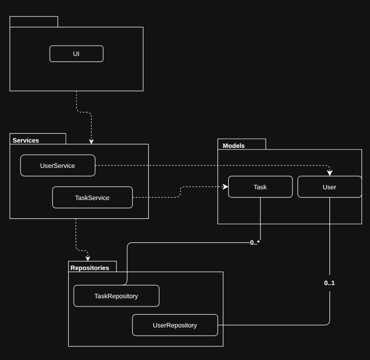
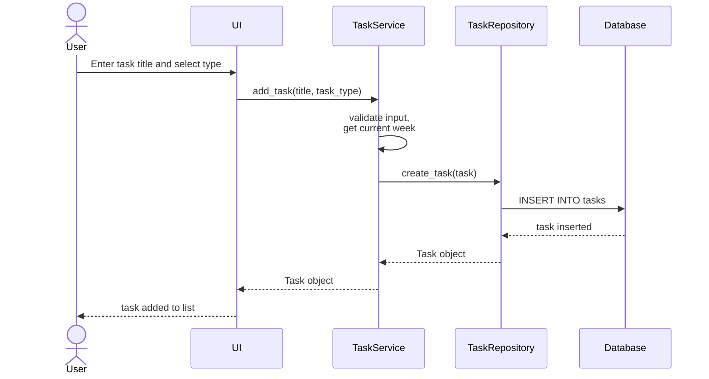
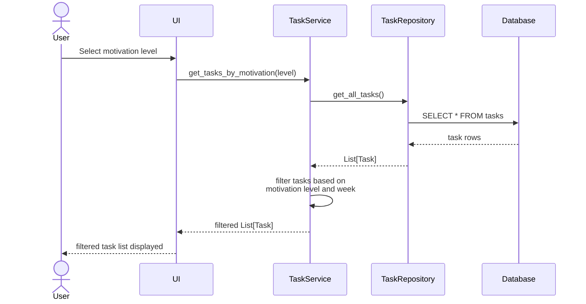
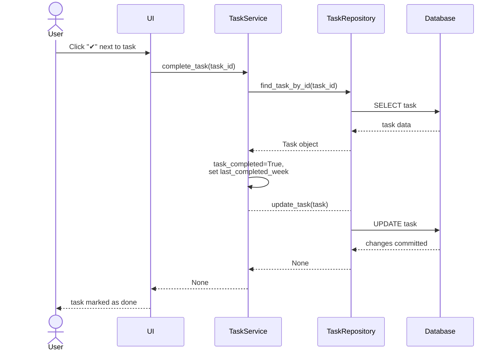

# Arkkitehtuurikuvaus

### Luokka/pakkauskaavio

## Päätoiminnallisuudet

### Tehtävän luonti

```mermaid
sequenceDiagram
    actor User
    participant UI
    participant TaskService
    participant TaskRepository
    participant Database

    User->>UI: Enter task title and select type
    UI->>TaskService: add_task(title, task_type)
    TaskService->>TaskService: validate input,<br/>get current week
    TaskService->>TaskRepository: create_task(task)
    TaskRepository->>Database: INSERT INTO tasks
    Database-->>TaskRepository: task inserted
    TaskRepository-->>TaskService: Task object
    TaskService-->>UI: Task object
    UI-->>User: task added to list
```
### Tehtävien haku ja suodatus motivaatiotason mukaan

```mermaid
sequenceDiagram
    actor User
    participant UI
    participant TaskService
    participant TaskRepository
    participant Database

    User->>UI: Select motivation level
    UI->>TaskService: get_tasks_by_motivation(level)
    TaskService->>TaskRepository: get_all_tasks()
    TaskRepository->>Database: SELECT * FROM tasks
    Database-->>TaskRepository: task rows
    TaskRepository-->>TaskService: List[Task]
    TaskService->>TaskService: filter tasks based on<br/>motivation level and week

    TaskService-->>UI: filtered List[Task]
    UI-->>User: filtered task list displayed
```

### Tehtävän merkitseminen suoritetuksi

```mermaid
sequenceDiagram
    actor User
    participant UI
    participant TaskService
    participant TaskRepository
    participant Database

    User->>UI: Click "✔" next to task
    UI->>TaskService: complete_task(task_id)
    TaskService->>TaskRepository: find_task_by_id(task_id)
    TaskRepository->>Database: SELECT task
    Database -->>TaskRepository: task data
    TaskRepository-->>TaskService: Task object
    TaskService->>TaskService: task_completed=True,<br/>set last_completed_week
    TaskService-->TaskRepository: update_task(task)
    TaskRepository->>Database: UPDATE task
    Database-->>TaskRepository: changes committed
    TaskRepository-->>TaskService: None
    TaskService-->>UI: None
    UI-->>User: task marked as done
```
