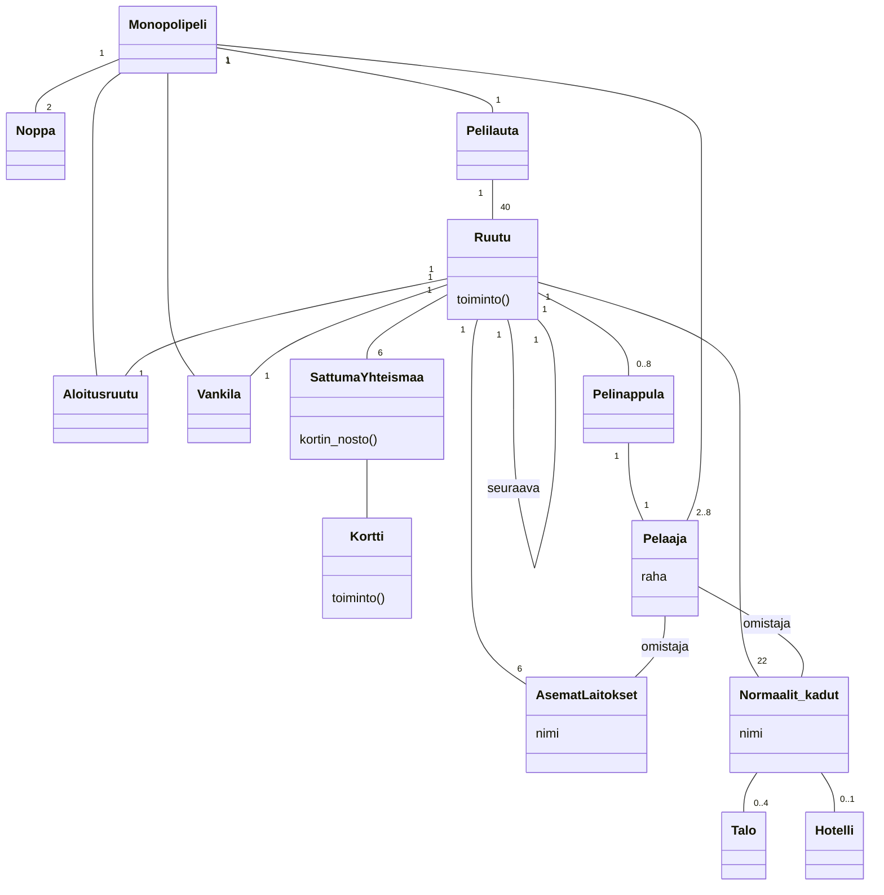

```mermaid
 classDiagram
    Monopolipeli "1" -- "2" Noppa
    Monopolipeli "1" -- "1" Pelilauta
    Monopolipeli -- Aloitusruutu
    Monopolipeli -- Vankila
    Pelilauta "1" -- "40" Ruutu
    Ruutu "1" -- "1" Aloitusruutu
    Ruutu "1" -- "1" Vankila
    Ruutu: toiminto()
    Ruutu "1" -- "1" Ruutu : seuraava
    Ruutu "1" -- "0..8" Pelinappula
    Ruutu "1" -- "6" SattumaYhteismaa
    Ruutu "1" -- "6" AsematLaitokset
    Ruutu "1" -- "22" Normaalit_kadut
    SattumaYhteismaa: kortin_nosto()
    SattumaYhteismaa -- Kortti
    Kortti: toiminto()
    AsematLaitokset: nimi
    Pelaaja -- AsematLaitokset : omistaja
    Normaalit_kadut: nimi
    Normaalit_kadut -- "0..4" Talo
    Normaalit_kadut -- "0..1" Hotelli
    Pelaaja -- Normaalit_kadut : omistaja
    Pelaaja: raha
    Pelinappula "1" -- "1" Pelaaja
    Pelaaja "2..8" -- "1" Monopolipeli
```