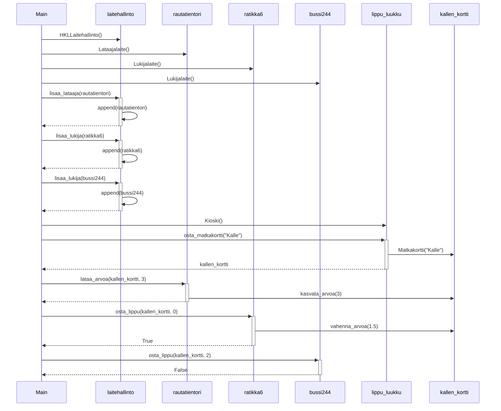

```mermaid
sequenceDiagram
    Participant Main
    Participant laitehallinto
    Participant rautatientori
    Participant ratikka6
    Participant bussi244
    Participant lippu_luukku
    Participant kallen_kortti

    Main->>laitehallinto: HKLLaitehallinto()
    Main->>rautatientori: Lataajalaite()
    Main->>ratikka6: Lukijalaite()
    Main->>bussi244: Lukijalaite()
    Main->>+laitehallinto: lisaa_lataaja(rautatientori)
    laitehallinto->>laitehallinto: append(rautatientori)
    laitehallinto-->>-Main:
    Main->>+laitehallinto: lisaa_lukija(ratikka6)
    laitehallinto->>laitehallinto: append(ratikka6)
    laitehallinto-->>-Main:
    Main->>+laitehallinto: lisaa_lukija(bussi244)
    laitehallinto->>laitehallinto: append(bussi244)
    laitehallinto-->>-Main:
    Main->>lippu_luukku: Kioski()
    Main->>+lippu_luukku: osta_matkakortti("Kalle")
    lippu_luukku->>kallen_kortti: Matkakortti("Kalle")
    lippu_luukku-->>-Main: kallen_kortti
    Main->>+rautatientori: lataa_arvoa(kallen_kortti, 3)
    rautatientori->>kallen_kortti: kasvata_arvoa(3)
    rautatientori-->>-Main:
    Main->>+ratikka6: osta_lippu(kallen_kortti, 0)
    ratikka6->>kallen_kortti: vahenna_arvoa(1.5)
    ratikka6-->>-Main: True
    Main->>+bussi244: osta_lippu(kallen_kortti, 2)
    bussi244-->>-Main: False
```